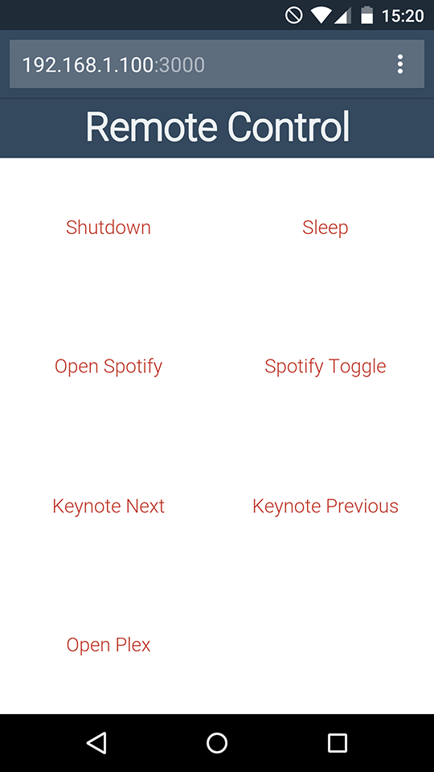

# remote-control

This package enables you to remotely access your machine with predefined commands listed in a JSON-file (after authentication). Want to be able to shutdown your Mac from your phone? Simply add:

```json
{
  "name": "Shutdown",
  "exec": "osascript -e 'tell app \"System Events\" to shut down'",
  "confirm": true
}
```

Screenshot of the interface:



## Install
Clone this repository and run `npm install`. Copy `.env.example` to `.env` and edit the variables.

You can run the Node server in the background with `forever` by running:

```
npm run-script start
```

And stop it with:

```
npm run-script stop
```

## Usage

Add the commands you would like to run / see in `commands.json`. Each command requires a `name` and `exec` property. Optional are:

- `confirm` (boolean) - Show a confirmation prompt before executing the command.
- `dir` - working directory of command.
